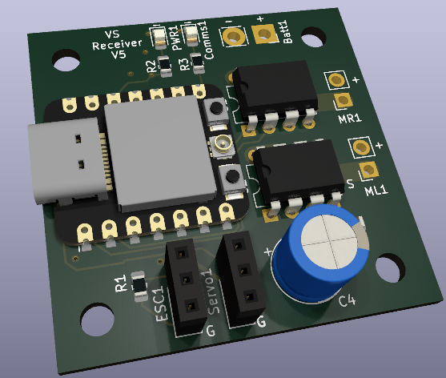

This is an open source, low cost, DIY combat robot kit. It is designed for use with antweight (1lb) and beetleweight (3lb) combat robots.

This repository includes PCB designs for the transmitter and receiver, the associated software, as well as a simple 3d printable chassis and controller design.

# Troubleshooting

# Invalid head of packet
If the following error occurs when trying to upload to the ESP32, the fix is to hold pin D9 to ground while powering on the board.

A fatal error occurred: Invalid head of packet (0x01): Possible serial noise or corruption.
Failed uploading: uploading error: exit status 2
