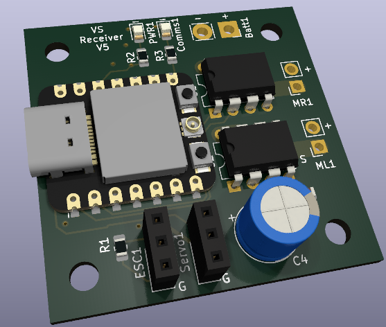

This is an open source, low cost, DIY combat robot kit. It is designed for use with antweight (1lb) and beetleweight (3lb) combat robots.

This repository includes PCB designs for the transmitter and receiver, the associated software, as well as a simple 3d printable chassis and controller design.

# Pairing Receiver and Transmitter
- On the receiver, hold the B button for 3 seconds to enter pairing mode.
- On the transmitter, hold L trigger, R trigger, and depress the right thumb joystick at the same time for 3 seconds to enter pairing mode. Once in pairing mode, the wifi LED will blink rapidly. The transmitter will stay in this state for 15 seconds unless it is paired quicker.
- Once paired, the comms1 LED on the receiver will blink slowly, like a heartbeat. The transmitter LCD will show Robot Connected.

# Troubleshooting

# Invalid head of packet
If the following error occurs when trying to upload to the ESP32, the fix is to hold pin D9 to ground while powering on the board.

A fatal error occurred: Invalid head of packet (0x01): Possible serial noise or corruption.
Failed uploading: uploading error: exit status 2
